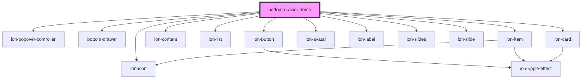

# ion-pull-menu

<!-- Auto Generated Below -->

## Dependencies

### Depends on

- ion-popover-controller
- ion-icon
- [bottom-drawer]()
- ion-button
- ion-content
- ion-list
- ion-item
- ion-avatar
- ion-label
- ion-slides
- ion-slide
- ion-card

### Graph

----------------------------------------------

*Built with [StencilJS](https://stenciljs.com/)*
